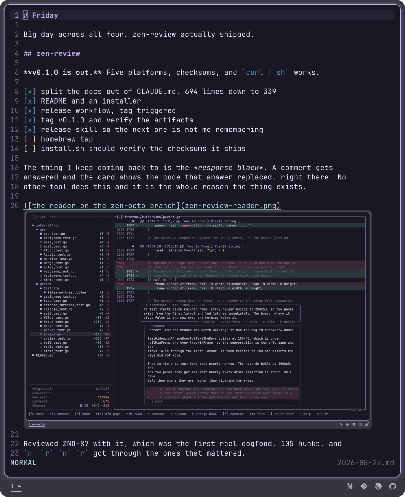
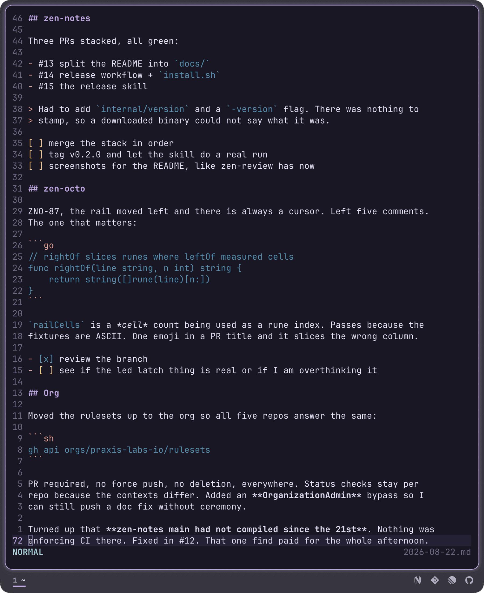

# zen-notes

One notepad per day. Run `zen-notes` from anywhere and you land in today's
note, already open. Two terminals on the same day stay in sync.

Markdown, syntax highlighted as you type, edited with vim motions. Images
render inline where your terminal supports it. Nothing else.



A line holding nothing but an image reference draws the picture under it. The
line stays as you typed it, and the image is scaled so it never buries what you
wrote around it. That needs a terminal speaking the kitty graphics protocol;
everywhere else the line stays text and nothing else changes.

Line numbers are hybrid, absolute on the cursor's line and relative everywhere
else, in a gutter that is always reserved so text never shifts.

## Install

```sh
go install github.com/praxis-labs-io/zen-notes@latest
```

Go 1.26 or later, and no other runtime dependency. The binary lands in `$GOBIN`,
or `$GOPATH/bin` if that is unset. [Install](docs/install.md) covers putting it
somewhere else, and where your notes end up.

## A first note

```sh
zen-notes
```

That is the whole of it. You are in today's note in normal mode, and vim motions
work. There is no save key: the buffer reaches disk within half a second of an
edit. `[` and `]` walk to yesterday and tomorrow, `\` comes back to today, and
`?` lists every binding without leaving the app.



Headings, bold, emphasis, code spans and fences, quotes, links and task boxes
each take their own colour. No colour is hardcoded: everything reads from ANSI
slots 0 to 15, so it comes from your terminal theme rather than fighting it.

## Documentation

- [Guide](docs/guide.md) — where notes live and how they sync, when an image
  draws, and what the screen is made of
- [Keys](docs/keys.md) — every binding, and what insert mode does with Markdown
- [Install](docs/install.md) — requirements, the notes directory, upgrading
- [Contributing](docs/CONTRIBUTING.md) — the layout, the test conventions, and
  what is deliberately out of scope

## License

MIT. See [LICENSE](LICENSE).

Built on [Bubble Tea](https://github.com/charmbracelet/bubbletea) and
[Lipgloss](https://github.com/charmbracelet/lipgloss) (MIT),
[fsnotify](https://github.com/fsnotify/fsnotify) (BSD-3-Clause),
[go-colorful](https://github.com/lucasb-eyer/go-colorful) and
[go-runewidth](https://github.com/mattn/go-runewidth) (MIT).
